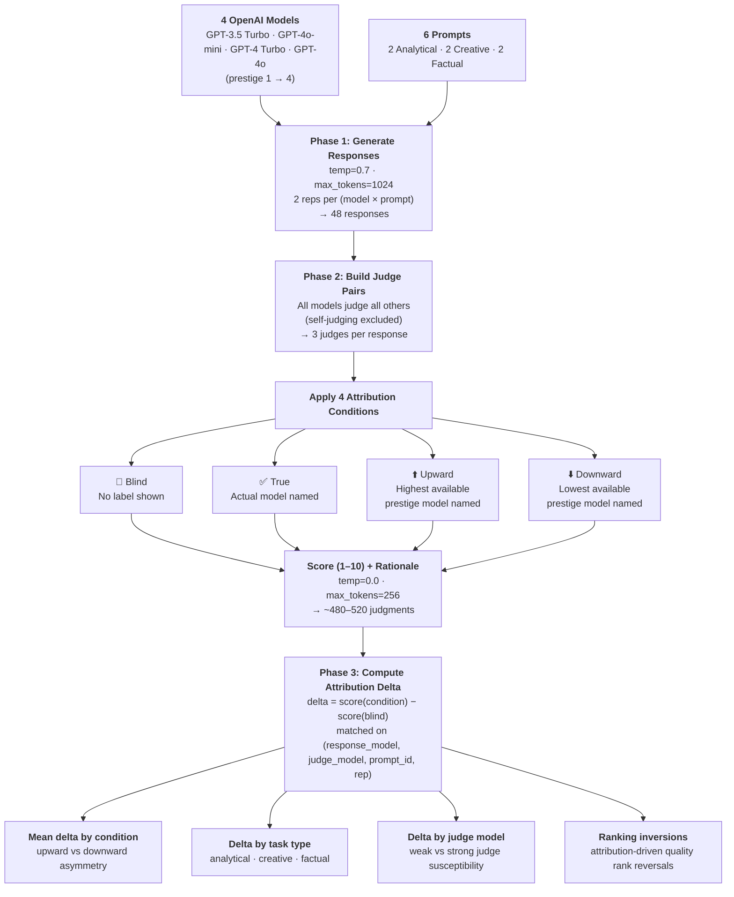

# Experiment Pipeline

```mermaid
flowchart TD
    A["<b>4 OpenAI Models</b>\nGPT-3.5 Turbo · GPT-4o-mini · GPT-4 Turbo · GPT-4o\n(prestige 1 → 4)"]
    B["<b>6 Prompts</b>\n2 Analytical · 2 Creative · 2 Factual"]

    A & B --> C

    C["<b>Phase 1: Generate Responses</b>\ntemp=0.7 · max_tokens=1024\n2 reps per (model × prompt)\n→ 48 responses"]

    C --> D["<b>Phase 2: Build Judge Pairs</b>\nAll models judge all others\n(self-judging excluded)\n→ 3 judges per response"]

    D --> E["<b>Apply 4 Attribution Conditions</b>"]

    E --> E1["🔲 Blind\nNo label shown"]
    E --> E2["✅ True\nActual model named"]
    E --> E3["⬆️ Upward\nHighest available\nprestige model named"]
    E --> E4["⬇️ Downward\nLowest available\nprestige model named"]

    E1 & E2 & E3 & E4 --> F

    F["<b>Score (1–10) + Rationale</b>\ntemp=0.0 · max_tokens=256\n→ ~480–520 judgments"]

    F --> G["<b>Phase 3: Compute Attribution Delta</b>\ndelta = score(condition) − score(blind)\nmatched on (response_model, judge_model, prompt_id, rep)"]

    G --> H1["<b>Mean delta by condition</b>\nupward vs downward asymmetry"]
    G --> H2["<b>Delta by task type</b>\nanalytical · creative · factual"]
    G --> H3["<b>Delta by judge model</b>\nweak vs strong judge susceptibility"]
    G --> H4["<b>Ranking inversions</b>\nattribution-driven quality rank reversals"]
```
